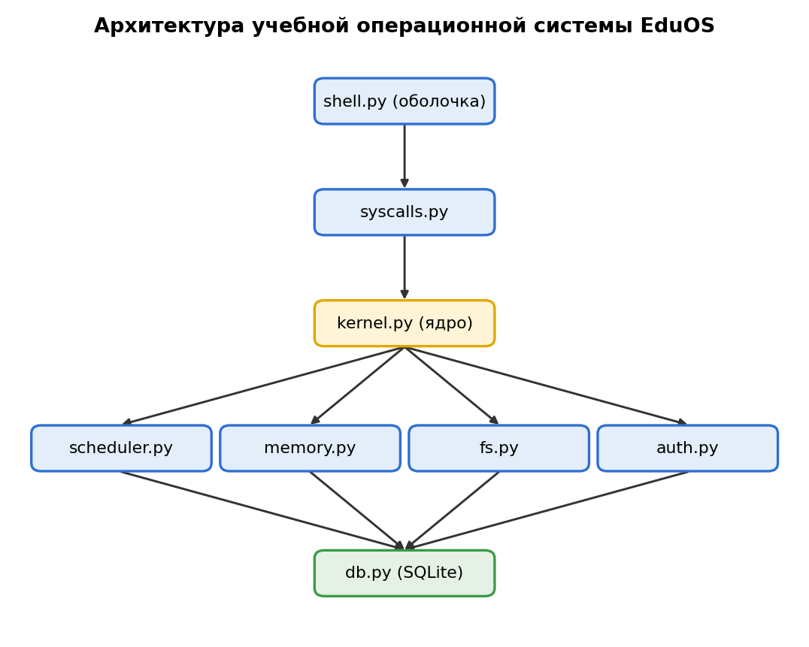

# Архитектура ОС



*Рисунок 1. Диаграмма компонентов EduOS. Стрелка означает «вызывает». Исходник: `02_component_diagram.drawio`.*

**Правило:** стрелки идут только сверху вниз. Оболочка не вызывает ядро и базу напрямую —
только `syscalls.py`. Правило проверяется автотестом `tests/test_architecture.py`.

## 1. Состав модулей

- `shell.py` — командная оболочка (User Space), читает команды пользователя
- `syscalls.py` — системные вызовы, интерфейс между оболочкой и ядром, журналирование в `syscalls_log`
- `kernel.py` — ядро, принимает вызовы и координирует подсистемы
- `scheduler.py` — планировщик, управляет процессами
- `memory.py` — управление памятью
- `fs.py` — файловая система, работает с файлами
- `auth.py` — аутентификация и права доступа
- `db.py` — работа с SQLite (единственный модуль, который открывает базу)

> Исключение для `syscalls.py`: он использует `db.py` только для журналирования и создания БД при запуске,
> а не для данных ОС (пользователи, файлы, процессы).

## 2. Системные вызовы

```python
sys_login(login: str, password: str) -> bool
sys_logout() -> bool
sys_whoami() -> str
sys_create_file(path: str, content: str) -> int
sys_read_file(path: str) -> str
sys_delete_file(path: str) -> bool
sys_list_files(path: str) -> list
sys_exec(name: str) -> int
sys_ps() -> list
sys_kill(pid: int) -> bool
sys_mem_alloc(size: int) -> int
sys_logs(limit: int) -> list
sys_shutdown() -> bool
```

Во всех функциях последним необязательным параметром идёт `current_user` (кто вызывает, по умолчанию `"guest"`),
он нужен для проверки прав и записи в журнал. Дополнительно сохранены вызовы занятия 1: `sys_echo`, `sys_get_users`.

Состояние реализации: `sys_login` проверяет наличие логина в таблице `users` (проверка пароля будет добавлена позже),
`sys_logs` читает журнал из БД, остальные вызовы — заглушки с фиксированным результатом
(`sys_exec` → 42, `sys_ps` → `[]`, `sys_read_file` → `""`).

## 3. Контракты системных вызовов

### sys_login
- **Предварительное условие:** пользователь с таким логином есть в базе (таблица `users`).
- **Постусловие:** возвращено `True` (логин найден) или `False` (не найден).
- **Побочный эффект:** запись в журнал `syscalls_log` со статусом `OK` или `FAIL`; пароль в журнал не пишется.

### sys_create_file
- **Предварительное условие:** пользователь авторизован.
- **Постусловие:** файл создан, возвращён его `id`.
- **Побочный эффект:** запись в `syscalls_log`; новая запись в таблице `files`.

### sys_kill
- **Предварительное условие:** процесс с указанным `pid` существует и вызывающий является его владельцем или администратором.
- **Постусловие:** процесс переведён в состояние `terminated`, возвращено `True`; иначе `False`.
- **Побочный эффект:** запись в `syscalls_log`; освобождается память процесса.

## 4. Структуры данных

```python
process = {
    'pid': 1,
    'name': 'shell',
    'state': 'running',        # new | ready | running | waiting | terminated
    'owner': 'admin',
    'memory': 120,             # КБ
    'created_at': '2025-01-01 10:00:00'
}

file = {
    'id': 1,
    'path': '/home/test.txt',
    'content': 'hello',
    'owner': 'admin',
    'created_at': '2025-01-01 10:00:00'
}

user = {
    'id': 1,
    'login': 'admin',
    'password_hash': 'abc123...',   # SHA-256, пароль в открытом виде не хранится
    'role': 'admin'                 # admin | user
}

log = {
    'id': 1,
    'syscall_name': 'sys_login',
    'args': 'admin',
    'user': 'admin',
    'status': 'OK',
    'timestamp': '2025-01-01 10:00:00'
}
```

Соответствие таблицам БД: `process` → `processes` (в БД поля `owner_id`, `memory_kb`),
`file` → `files` (поле `owner_id`), `user` → `users`, `log` → `syscalls_log`.
